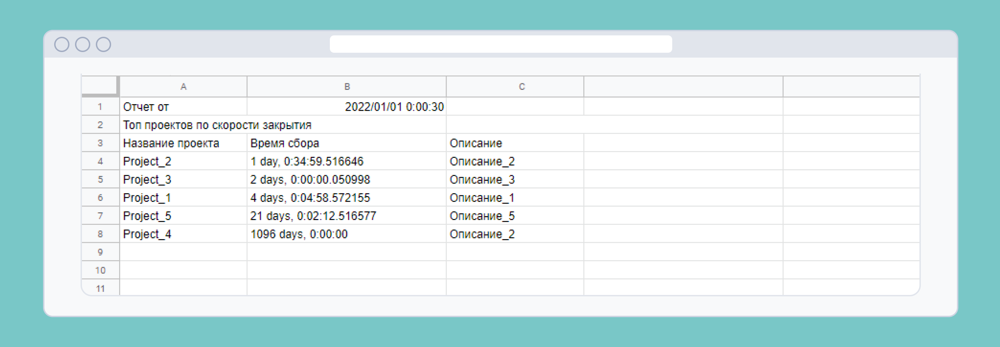

# Приложение QRKot

1) [О приложении](#1)
    * [Проекты](#1.1)
    * [Пожертвования](#1.2)
    * [Пользователи](#1.3)
    * [Googlesheets](#1.4)
1) [Запуск приложения](#2)
1) [Техно-стек](#3)
1) [Автор](#4)


   


## О приложении: <a name="1"></a>

Фонд собирает пожертвования на различные целевые проекты: на медицинское обслуживание нуждающихся хвостатых, на
обустройство кошачьей колонии в подвале, на корм оставшимся без попечения кошкам — на любые цели, связанные с поддержкой
кошачьей популяции.

### Проекты <a name="1.1"></a>

В Фонде QRKot может быть открыто несколько целевых проектов. У каждого проекта есть название, описание и сумма, которую
планируется собрать. После того, как нужная сумма собрана — проект закрывается.
Пожертвования в проекты поступают по принципу First In, First Out: все пожертвования идут в проект, открытый раньше
других; когда этот проект набирает необходимую сумму и закрывается — пожертвования начинают поступать в следующий
проект.

### Пожертвования <a name="1.2"></a>

Каждый пользователь может сделать пожертвование и сопроводить его комментарием. Пожертвования не целевые: они вносятся в
фонд, а не в конкретный проект. Каждое полученное пожертвование автоматически добавляется в первый открытый проект,
который ещё не набрал нужную сумму. Если пожертвование больше нужной суммы или же в Фонде нет открытых проектов —
оставшиеся деньги ждут открытия следующего проекта. При создании нового проекта все неинвестированные пожертвования
автоматически вкладываются в новый проект.

### Пользователи <a name="1.3"></a>

Целевые проекты создаются администраторами сайта.
Любой пользователь может видеть список всех проектов, включая требуемые и уже внесенные суммы. Это касается всех
проектов — и открытых, и закрытых.
Зарегистрированные пользователи могут отправлять пожертвования и просматривать список своих пожертвований.

### Googlesheets <a name="1.4"></a>

Администратор сайта может запросить отчет google-таблице от даты создания.
В таблице отображаются закрытые проекты, отсортированные по скорости сбора средств — от тех, что закрылись быстрее
всего, до тех, что долго собирали нужную сумму.
Пример отчета:


## Запуск приложения: <a name="2"></a>

- Клонируйте репозиторий yacut командой в терминале:

```commandline
...$  https://github.com/AlinaProvotorova/cat_charity_fund.git
```

- Активируйте виртуальное окружение командой:

```commandline
...cat_charity_fun $ python -m virtualenv venv && .\venv\Scripts\activate
```

- Установите зависимости командой:

```
(venv) ...$ python3 -m pip install --upgrade pip
```

```
(venv) ...$ pip install -r requirements.txt
```

- Примените миграции:

```
(venv) ...$ alembic upgrade head
```

- Запустите сервер:

```
(venv) ...$ uvicorn app.main:app --reload
```

После запуска перейдите по [ссылке](http://127.0.0.1:8000/docs)

## Техно-стек: <a name="3"></a>

- Python
- FastAPI
- Google API
- SQLAlchemy
- Pydantic
- Alembic
- Asyncio

Автор: [Провоторова Алина Игоревна](https://t.me/alinamalina998) <a name="4"></a>
